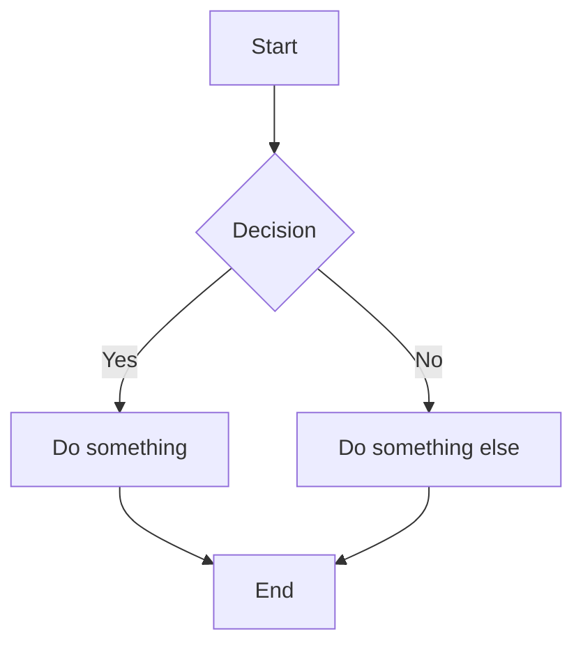

# Add a Mermaid Rendering Plugin

Below is the complete Mermaid plugin, fully aligned with:

- your ULDE plugin architecture
- your naming conventions
- Angular v21 SSR constraints
- your existing UldeViewer browser‑check
- your preference for clean layering (Mermaid stays out of Angular)

This plugin will:

- detect Mermaid code blocks
- convert them into &lt;div class="mermaid">…&lt;/div>
- load Mermaid only in the browser
- render diagrams after ULDE finishes
- avoid SSR issues
- integrate cleanly into the ULDE lifecycle

## 1. Install Mermaid
```
npm install mermaid
```

## 2. Create the Mermaid Plugin

Create:
```
src/app/ulde/plugin-system/plugins/mermaid/mermaid.plugin.ts
```
__mermaid.plugin.ts__
```ts
import mermaid from 'mermaid';
import { UldePlugin } from '../../registry/plugin-registry';

export const MermaidPlugin: UldePlugin = {
  name: 'mermaid',
  phase: 'interactive',   // render AFTER HTML is in place
  async run(ctx) {
    // 1. Replace ```mermaid code blocks with <div class="mermaid">...</div>
    ctx.html = ctx.html.replace(
      /```mermaid([\s\S]*?)```/g,
      (match, code) => {
        return `<div class="mermaid">${code.trim()}</div>`;
      }
    );

    // 2. Mermaid must run only in the browser
    if (typeof window === 'undefined') return;

    // 3. Initialize Mermaid (safe to call multiple times)
    try {
      mermaid.initialize({ startOnLoad: false });
      await mermaid.run();
    } catch (err) {
      console.error('[ULDE Mermaid Plugin] Failed to render diagram:', err);
    }
  }
};
```

__Why this works__

- Phase = interactive  
Mermaid must run after layout and content are in the DOM.
- SSR‑safe  
typeof window === 'undefined' prevents server execution.
- Idempotent  
Mermaid can be initialized multiple times safely.
- Plugin‑extensible  
This plugin is fully isolated from Angular.

## 3. Register the Plugin in Ulde

In:
```
src/app/ulde/core/ulde/ulde.ts
```

Add:
```ts
import { MermaidPlugin } from '../../plugin-system/plugins/mermaid/mermaid.plugin';
```

Then in the constructor:
```ts
constructor() {
  this.plugins.register(HeadingAnchorsPlugin);
  this.plugins.register(TimingPlugin);
  this.plugins.register(MermaidPlugin);
}
```

## 4. Add Mermaid Styles (Optional but Recommended)

Add:
```scss
.mermaid {
  margin: 1.5rem 0;
}
```

Mermaid injects its own SVG styles, so this is enough.


## 5. Test It

Create a markdown file:
```
src/assets/docs/mermaid-test.md

Add:


Then load it:

http://localhost:4200/mermaid-test
```


You will see a rendered Mermaid diagram inside your layout shell.


